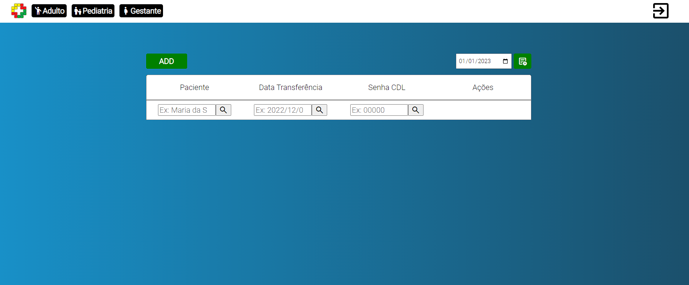
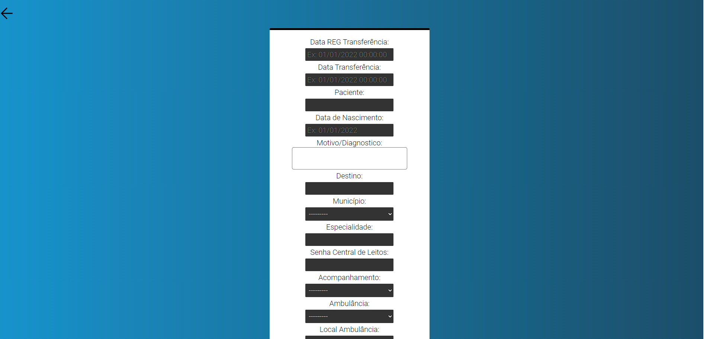

# Hrrbc-Nir


Bem-vindo ao Hrrbc-Nir! Este é um projeto desenvolvido com o intuito de controlar as transferências de pacientes e o uso de ambulâncias entre os municípios atendidos pelo Hospital Regional Ribeirão Bonito. Foi construído utilizando Python, Django, MySQL, JavaScript, HTML e CSS. Este documento fornece informações sobre as principais características do projeto e orientações sobre como configurar e executar localmente.

## Funcionalidades

- Registro e autenticação de usuários
- Cadastro de pacientes e suas informações médicas
- Agendamento e controle de transferências de pacientes
- Gestão do uso de ambulâncias
- Relatórios e estatísticas de transferências e utilização de ambulâncias

## Requisitos

Certifique-se de ter as seguintes ferramentas instaladas em seu sistema:

- Python (versão 3.7 ou superior)
- Django (versão 3.0 ou superior)
- MySQL (ou outro banco de dados suportado pelo Django)
- Git (opcional, para clonar o repositório)

## Configuração

1. Clone este repositório para o seu ambiente local (ou faça o download do ZIP):

```
git clone https://github.com/seu-usuario/hrrbc-nir.git
```

2. Navegue até o diretório raiz do projeto:

```
cd hrrbc-nir
```

3. Crie e ative um ambiente virtual (recomendado):

```
python3 -m venv venv
source venv/bin/activate
```

4. Instale as dependências do projeto:

```
pip install -r requirements.txt
```

5. Configure as informações do banco de dados no arquivo `settings.py`.

6. Execute as migrações do banco de dados:

```
python manage.py migrate
```

7. Inicie o servidor de desenvolvimento:

```
python manage.py runserver
```

8. Abra o navegador e acesse `http://localhost:8000` para acessar o sistema.

## Contribuição

Se você deseja contribuir para o projeto, siga as etapas abaixo:

1. Fork este repositório e clone-o em seu ambiente local.

2. Crie um branch para sua nova funcionalidade:

```
git checkout -b minha-nova-funcionalidade
```

3. Faça as alterações necessárias e faça commit das mesmas:

```
git commit -m "Adiciona minha nova funcionalidade"
```

4. Envie as alterações para o repositório remoto:

```
git push origin minha-nova-funcionalidade
```

5. Abra uma pull request no repositório original.

## Capturas de tela




## Licença

Este projeto está licenciado sob a [MIT License](LICENSE).

---
O Hrrbc-Nir é um projeto desenvolvido para controlar as transferências de pacientes e o uso de ambulâncias entre os municípios atendidos pelo Hospital Regional Ribeirão Bonito. Utilizando tecnologias como Python, Django, MySQL, JavaScript, HTML e CSS, o sistema permite o registro e autenticação de usuários, cadastro de pacientes, agendamento de transferências, gest

ão de ambulâncias e geração de relatórios estatísticos. Com uma interface intuitiva e recursos avançados, o Hrrbc-Nir melhora a eficiência e a organização do processo de transferência de pacientes, contribuindo para um atendimento mais ágil e seguro.